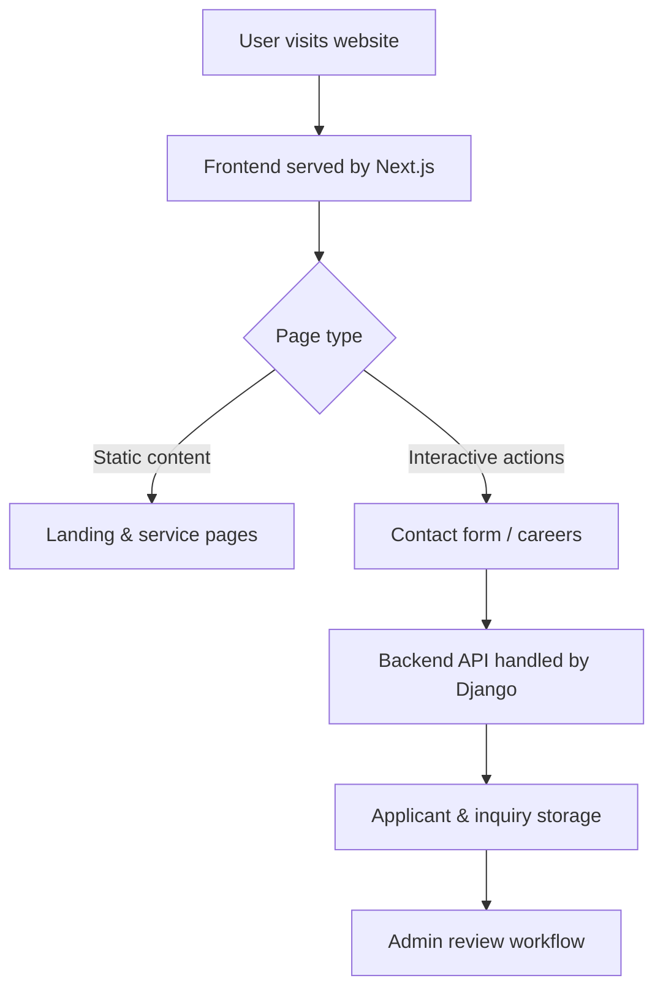

# Lifewood Website

## 📖 Overview

Lifewood Website is a modern corporate web platform built to showcase Lifewood’s brand, services, careers, and internal initiatives with a polished digital presentation. It combines a React-based Next.js frontend experience with a Django backend for form handling, applicant management, and administrative workflows.

This repository is designed for digital marketing teams, product owners, and engineering teams who need a scalable, maintainable website architecture that separates frontend presentation from backend application logic.

## 🎯 Features

- Responsive landing pages for company services, careers, and news
- Dynamic applicant submission and administrative review workflows
- Dedicated admin dashboard routes and protected backend services
- Seamless frontend deployment through Vercel
- Backend-ready Django API for form processing and applicant management

## 🛠️ Tech Stack

| Layer | Technology | Purpose |
| --- | --- | --- |
| Frontend | Next.js 16 | Server-side rendering, routing, and static site generation |
| UI | React 19, Tailwind CSS 4 | User interface and styling |
| Animation | Framer Motion, GSAP, React Spring | Interactive page transitions and motion effects |
| Backend | Django | API endpoints, admin services, data models |
| Database | SQLite (development) | Local storage for applicant and inquiry data |
| Hosting | Vercel / Python-capable provider | Frontend deployment, backend runtime |

## 🚀 Getting Started

### Prerequisites

- Node.js 20+ and npm
- Python 3.11+ or compatible Python runtime
- Git

### Installation

```bash
git clone https://github.com/<your-org>/lifewood-website.git
cd lifewood-website
```

#### Install frontend dependencies

```bash
npm install --prefix frontend
```

#### Install backend dependencies

```bash
cd backend
python -m venv .venv
.venv\Scripts\Activate.ps1
pip install -r requirements.txt
```

### Run Locally

#### Start the frontend

```bash
npm --prefix frontend run dev
```

Visit `http://localhost:3000` to view the website locally.

#### Start the backend

```bash
cd backend
.venv\Scripts\Activate.ps1
python manage.py migrate
python manage.py runserver
```

Visit `http://127.0.0.1:8000` for Django backend endpoints and admin access.

## 📂 Project Structure

```text
lifewood-website/
├── backend/
│   ├── applicants/
│   │   ├── admin.py
│   │   ├── apps.py
│   │   ├── models.py
│   │   ├── urls.py
│   │   ├── views.py
│   │   ├── tests.py
│   │   └── templates/applicants/emails/
│   ├── lifewood_backend/
│   │   ├── settings.py
│   │   ├── urls.py
│   │   ├── wsgi.py
│   │   └── asgi.py
│   ├── manage.py
│   ├── requirements.txt
│   └── db.sqlite3
├── frontend/
│   ├── app/
│   │   ├── page.tsx
│   │   ├── admin-dashboard/page.tsx
│   │   ├── careers/page.tsx
│   │   ├── contact-us/page.tsx
│   │   └── components/
│   ├── public/
│   ├── package.json
│   ├── tsconfig.json
│   └── next.config.ts
├── package.json
└── vercel.json
```

## 📸 Visual Workflow Diagram



## 📈 Benchmarks & Performance

- Frontend optimized for Vercel production builds
- Static page rendering supports fast Time-to-First-Byte (TTFB)
- Minimal bundle footprint using Tailwind CSS and modular React components
- Backend uses lightweight Django stack for efficient form submission and admin operations

> Note: Detailed performance benchmarks are environment-specific. Run profiling with Lighthouse or your preferred analytics tool for exact metrics on your deployment.

## 🧪 Testing

- Frontend linting available via `npm --prefix frontend run lint`
- Backend test suite can be executed with Django test runner

```bash
cd backend
.venv\Scripts\Activate.ps1
python manage.py test
```

## 📜 License

This repository currently does not include a dedicated license file. Please contact the project owner or maintainers for licensing details before using or redistributing the content.

## 🤝 Contributing

Thank you for your interest in contributing. To propose changes:

1. Fork the repository
2. Create a feature branch
3. Submit a pull request with a clear description
4. Include tests and documentation updates where applicable

Please keep contributions aligned with the project’s quality standards and deployment model.

## 📧 Contact / Support

For support, questions, or deployment guidance, please contact the project maintainer or the Lifewood team directly.

- Email: `support@lifewood.example.com`
- Repository issues: use GitHub Issues on this repository
